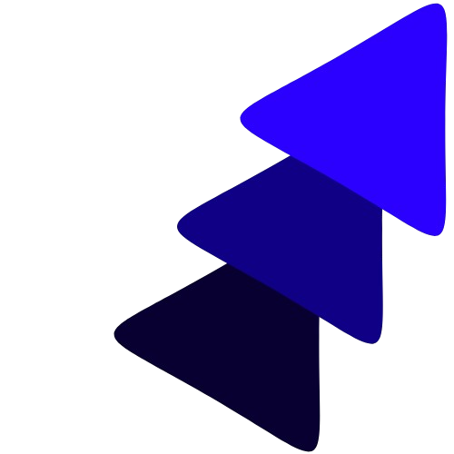

<h1 align="center" style="font-size: 36px;">
  
  CTO of DiffuseAI
</h1>

  🧠 AI Developer | 🔬 Tech & Science Enthusiast

---

### 🔥 About Me  
- 🎓 12th Grade | Aspiring to study at **IIT Madras**  
- ⚡ Building **Quotidian Quotes, Quotan4Day, and a Safety App**  
- 🖥️ Passionate about **AI, 3D Printing, Electronics, and Automation**  
- 🔬 Exploring **Magnetic Wave Detection & AI-Powered Solutions**  

---

## 🌍 Connect With Me  

  
  

### 🛠️ Tech Stack  

---

### 📊 GitHub Stats  

  
  

---

## 📌 Featured Projects  

🚗 **WiFi-Based Solar Car**  
🔹 A smart solar-powered vehicle controlled via WiFi.  

📡 **WiFi-Bluetooth Deauther Device**  
🔹 A security tool for testing network vulnerabilities.  

🛡️ **Safety App**  
🔹 Emergency helpline & security features for instant help.  

💡 **DiffuseAI Innovations**  
🔹 AI-driven projects exploring automation & deep learning.  

---

💡 *"Behind the Curtain of Words"*  
